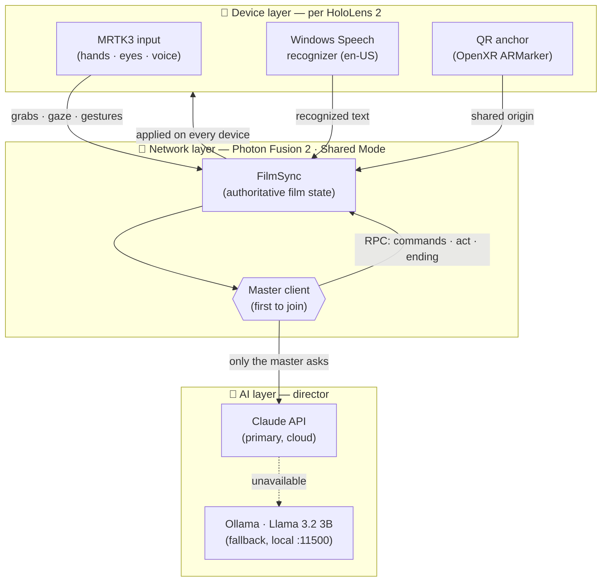
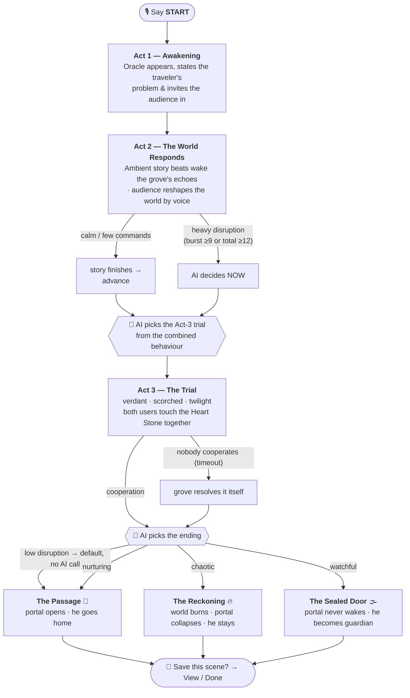
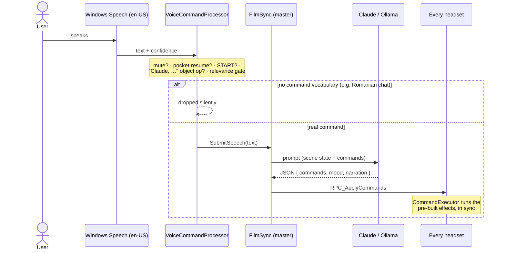
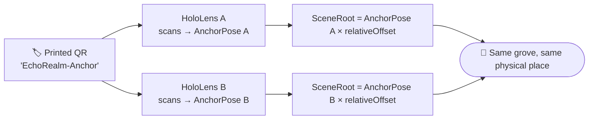
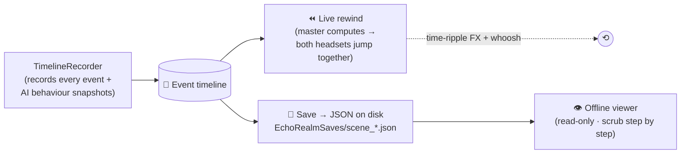

<div align="center">

# 🌿 EchoRealm

### Adaptive Interactive Mixed-Reality Film with AI-Driven Narrative & Voice Control on Microsoft HoloLens 2

*A living holographic grove that two people share, shape with their voices, and watch the AI direct — in real time.*


-D97757)


</div>

---

## ✨ What is EchoRealm?

EchoRealm is a **multi-user mixed-reality film** for Microsoft HoloLens 2. Two (or more) people stand in the same physical room and see the **same holographic grove** anchored to the same spot. A traveler — an astronaut who fell through a broken door between worlds — must find his way home. The film **plays on its own** from start to finish, but at **any moment** the audience can intervene with their **voice**, **gaze**, and **hands**, and a **Large Language Model acts as the director**: it interprets what they do and decides how the story continues — including the protagonist's fate.

The core research claim: **the AI is not a chatbot bolted onto a scene — it is the active director.** It reads the *combined* behaviour of the audience and returns narrative decisions with immediate, diverging consequences that would be impractical to author with classic decision trees.

> 🎓 **MSc dissertation** — Samuel Dascălu, supervised by Prof. univ. dr. ing. **Radu-Daniel Vatavu**, Faculty of Electrical Engineering and Computer Science (FIESC), *Ștefan cel Mare* University of Suceava, 2026.

<div align="center">
<br>
<i>📸 Drop a through-the-lens screenshot or capture GIF of the grove here.</i>
<br><br>
</div>

---

## 🌟 Highlights

| | Feature |
|---|---|
| 🎬 | **A film that plays itself** — scripted Oracle/Astronaut beats walk the story forward with zero audience input, yet stay fully interruptible. |
| 🧠 | **LLM as director** — Claude (cloud) or Llama 3.2 3B (local via Ollama) interprets natural speech and chooses act variants. |
| 🍃 | **Diverging endings the AI decides** — *The Passage* (he goes home), *The Reckoning* (the grove burns, the portal collapses), *The Sealed Door* (he stays as guardian). |
| ⚡ | **Disruption-proportional pacing** — calm audiences get the default journey; heavy interventions make the AI decide *sooner* and *darker*. |
| 🗣️ | **Natural-language voice control** — "make it rain", "set it on fire", "Claude, make this bigger" (gaze-targeted). |
| 🤝 | **Mandatory cooperation** — the grove's heart opens only when **both** users touch the Heart Stone together. |
| 🖐️ | **Hand magic** — pocket the whole world, hold it shrunk in your palm, push it back with a chest-forward gesture. |
| ⏪ | **Rewind & replay** — jump the shared world back in time (synced on both headsets, with a time-ripple FX), save the run to disk, and re-watch it offline. |
| 📡 | **Co-located & networked** — QR-anchored shared coordinate frame + Photon Fusion 2; everyone sees the same thing in the same place. |
| 💸 | **Zero cloud lock-in** — runs fully offline & free via Ollama; no Azure Spatial Anchors (retired), no per-seat services. |

---

## 🏛️ System Architecture

Three layers: each **device** runs the MR interface, a shared **network** layer co-locates and synchronises the world, and an **AI** layer (cloud or local) directs the narrative. Only the **master** talks to the AI; its decisions are broadcast to everyone.



---

## 🎞️ The Four-Act Flow

The film advances on its own; the audience can nudge or storm it. What they do is scored, and the AI's choices scale with that score.



---

## 🗣️ Voice Command Pipeline

Every utterance is gated locally (language + relevance + mute) so side-conversation never reaches the AI; real commands are interpreted by the **master**, which broadcasts the result to all headsets.



---

## 📐 Co-location (shared physical space)

Azure Spatial Anchors and the HoloLens Sharing Service were retired, so EchoRealm co-locates with a **printed QR code** + **Photon Fusion 2**. Each headset expresses the scene **relative to the QR pose**, so the same offset lands in the same physical spot for everyone.



---

## ⏪ Timeline · Rewind · Save · Replay

A single deterministic engine (`ApplyStateAt`) reconstructs the scene at any moment from a **baseline + ordered event log** — reused identically for live rewind and offline replay.



---

## 🧩 Tech Stack

| Component | Version / choice | Role |
|---|---|---|
| **Unity** | 2022.3.62f3 LTS (Built-In RP) | Engine; UWP / IL2CPP / ARM64 build |
| **MRTK3** | core 3.3 · spatialmanipulation 3.4 | Hands, eye-gaze, voice, manipulation, UX |
| **Mixed Reality OpenXR** | 1.11.2 | Hand/eye tracking, native QR-code anchoring |
| **Photon Fusion 2** | Shared Mode (region `eu`) | Multi-user state sync, master authority |
| **Claude API** | `claude-haiku-4-5` (default) | Primary director — variants, monologue, object ops |
| **Ollama + Llama 3.2 3B** | local, port **11500** | Offline fallback director (`11434` blocked by Hyper-V) |
| **Windows Speech** | UWP `SpeechRecognizer` (en-US) | On-device speech-to-text, no internet needed |
| **Visual Studio 2022** | UWP workload + C++ v143 | Compiles the Unity-generated UWP project |

---

## 🚀 Getting Started

### Prerequisites
- Unity **2022.3.62f3 LTS** with the **Universal Windows Platform** Build Support module
- Visual Studio 2022 (*Universal Windows Platform development* workload + *MSVC v143 ARM64* tools)
- A Microsoft **HoloLens 2** in **Developer Mode** (Device Portal enabled)
- *(optional, for offline AI)* [Ollama](https://ollama.com) on a LAN PC
- *(optional, for online AI)* an Anthropic API key

### 1. AI backend
```powershell
# Local fallback (offline-capable). 11434 is reserved by Hyper-V, so use 11500:
$env:OLLAMA_HOST = "127.0.0.1:11500"
ollama serve
ollama pull llama3.2:3b
```
For the **primary** backend, put your Anthropic key in
`EchoRealm/Assets/Resources/anthropic_api_key.txt` (git-ignored).

### 2. Networking
Create a free **Photon Fusion 2** app at [dashboard.photonengine.com](https://dashboard.photonengine.com) and paste the App ID into *Fusion Hub → Setup*.

### 3. Build & deploy to HoloLens 2
1. Print a QR code with payload `EchoRealm-Anchor` and place it where the grove should sit.
2. Unity → *File → Build Settings* → **UWP**, Architecture **ARM 64-bit**, Build Type **D3D Project** → **Build**.
3. Open the generated `.sln` in Visual Studio 2022 → **Release / ARM64 / Remote Machine** (HoloLens IP) → **Build → Deploy Solution**.
4. Launch on each headset, let them scan the QR, then **say "START"**.

---

## 🎮 Interaction Cheat-Sheet

| You do / say | What happens |
|---|---|
| **"START"** | Begins the film on every headset (before it starts). |
| **"make it rain" / "set it on fire" / "I want a forest"** | The grove transforms; the AI interprets free phrasing. |
| **"Claude, make this bigger"** (while looking at a prop) | Gaze-targeted object manipulation, synced everywhere. |
| 🤝 **Both touch the Heart Stone** | Solves the Act-3 cooperative trial. |
| 🖐️ **Shrink + pull the world low** | Pockets the world (pauses the film). |
| 🖐️ **Push your palm forward from the chest** | Un-pockets (resumes) the world. |
| ✋ **"bring the world to my palm"** | Shrinks the scene onto your open palm and follows it. |
| ⏪ **"Back 20s" / "Back 1 min"** buttons | Rewinds the shared world in time. |
| 🔇 **"stop listening" / "start listening"** | Mutes/unmutes command interpretation (talk freely). |

---

## 📁 Repository Layout

```
EchoRealm/                     Unity project
└─ Assets/Scripts/
   ├─ Networking/   QRAnchorManager · FusionNetworkManager · FilmSync
   ├─ AI/           AIManager · Claude/Ollama backends · VoiceCommandProcessor
   │                NarrativeDecisionEngine · CommandExecutor · DisruptionMeter
   ├─ Interaction/  EyeTracking · Gesture · CooperationDetector · WorldPocket
   │                PalmHold · PocketResumeGesture · RewindMenu
   ├─ Characters/   OracleController · AstronautController · OracleVoice
   ├─ Effects/      Weather · Environment · Skybox · CameraEffects · RewindFX
   └─ Film/         FilmDirector · ActManager · Timeline (record/replay/save)
Docs/                          Project bible, deploy guide, setup log
```

---

## 🔬 How the AI "directs"

At each act transition the **master** builds a behaviour summary — dominant archetype, nurture-vs-chaos tone, gaze focus, cooperation, and the live **disruption score** — and asks the AI to pick a variant key (`scorched`, `bittersweet`, …). The chosen key drives **what actually happens** (which obstacle, whether the portal opens or collapses), not just the tone. The decision is **validated and clamped** (falls back to a safe default if the AI is unavailable), then **broadcast** so every headset plays the same beat. The behaviour memory **rewinds with the timeline**, so undone actions stop influencing later decisions.

---

## 📜 Academic Context & Citation

This repository accompanies an MSc dissertation investigating whether an LLM-directed, co-located MR film increases **presence**, **engagement**, and perceived **uniqueness** versus a scripted equivalent (evaluated with IPQ + SUS plus automatic behavioural metrics).

```bibtex
@mastersthesis{dascalu2026echorealm,
  title  = {EchoRealm: Adaptive Interactive Mixed Reality Film with AI-Driven
            Narrative and Voice Control on Microsoft HoloLens 2},
  author = {Dascălu, Samuel},
  school = {Ștefan cel Mare University of Suceava, FIESC},
  year   = {2026},
  note   = {Supervisor: Prof. Radu-Daniel Vatavu}
}
```

---

<div align="center">
<sub>Built with Unity · MRTK3 · Photon Fusion 2 · Claude · Ollama — for the HoloLens 2.</sub>
</div>
